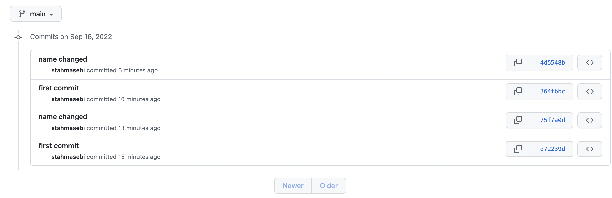
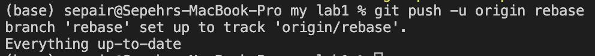

# ECE444-F2022-Lab1

Sepehr

Here is a screenshot of the commit:

Here is a screenshot of the output of the merge:

Here is a screenshot of the PR:

Here are three pictures of the rebase commands:

My commit to my teammate's repo is here:

And the link to his repo is: https://github.com/Funinja/ECE444-F2022-Lab1

The link to my copy of the EP repo is: https://github.com/sepair/ECE444-F2022-EP

